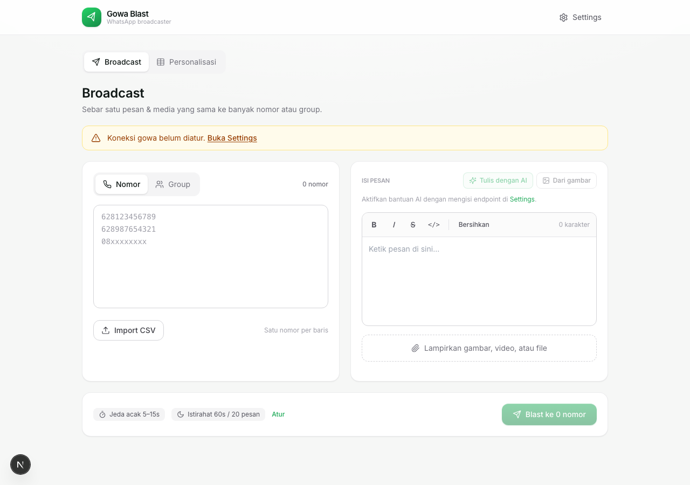
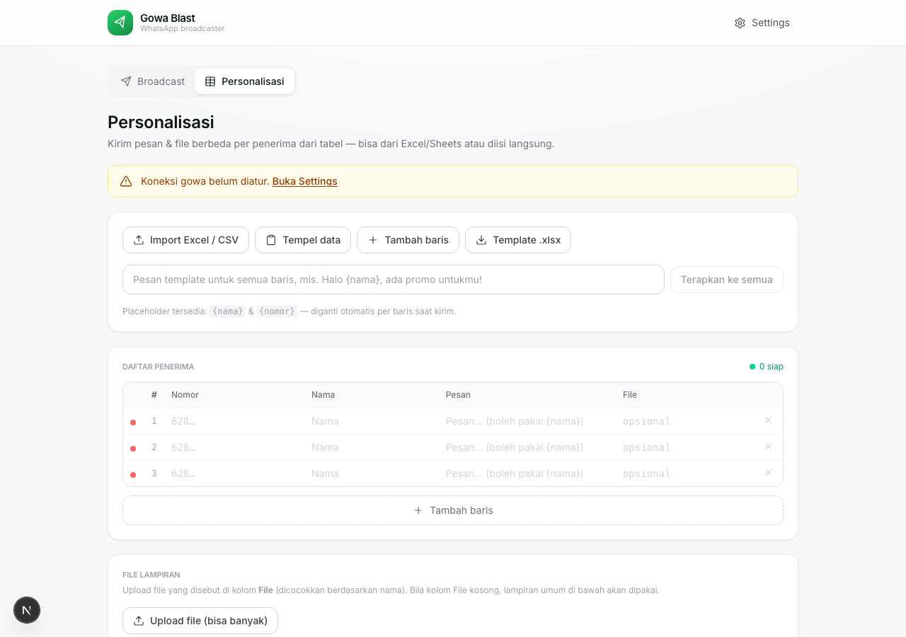
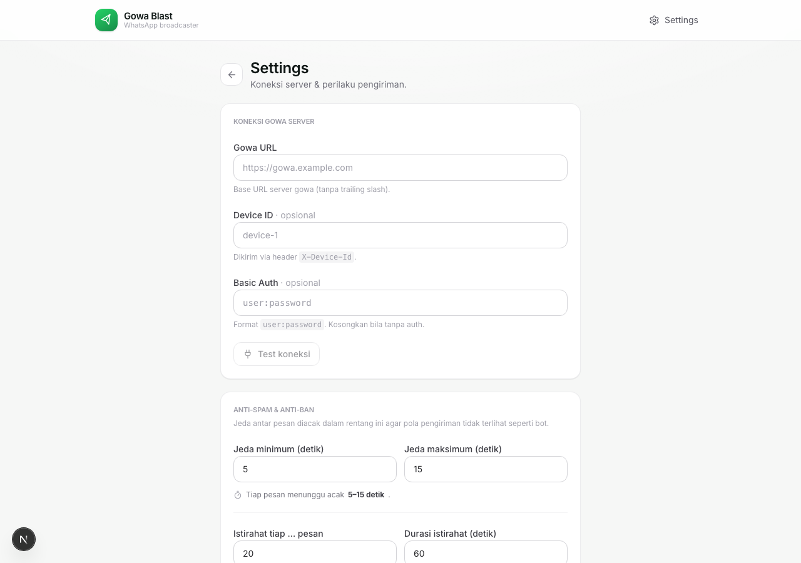

# Gowa Blast

Aplikasi **WhatsApp blast** berbasis Next.js untuk mengirim pesan & media ke banyak nomor atau group sekaligus, terhubung **langsung** ke server [go-whatsapp-web-multidevice (gowa)](https://github.com/aldinokemal/go-whatsapp-web-multidevice) — tanpa perantara n8n.

Dilengkapi sistem **anti-spam** (jeda acak + istirahat berkala) dan **bantuan AI** untuk menulis pesan (dari teks maupun dari gambar) lewat endpoint OpenAI-compatible.

---

## 📸 Screenshots

| Broadcast | Personalisasi | Settings |
|-----------|---------------|----------|
|  |  |  |

---

## ✨ Fitur

- **Kirim ke nomor** — input manual (satu per baris) atau import CSV.
- **Kirim ke group** — picker daftar group yang kamu ikuti, lengkap dengan pencarian & pilih semua.
- **Lampiran media** — gambar, video, atau file. Teks pesan otomatis jadi caption.
- **Editor format WhatsApp** — tebal, miring, coret, monospace, dengan pratinjau format.
- **Anti-spam / anti-ban**:
  - Jeda **acak** antar pesan dalam rentang menit–maks yang kamu tentukan (bukan waktu tetap).
  - **Istirahat** lebih lama setiap N pesan untuk meniru perilaku manusia.
  - Berhenti otomatis bila device gowa terputus / auth gagal.
- **Bantuan AI** (OpenAI-compatible):
  - **Tulis dengan AI** — rapikan draft/poin kasar jadi pesan WhatsApp sesuai persona.
  - **Dari gambar** — buat pesan berdasarkan gambar (vision) + konteks tambahan opsional.
  - Persona/gaya penulisan bisa diatur sendiri.
- **Log pengiriman real-time** — progress, jumlah berhasil/gagal, dan status per tujuan.

---

## 🧰 Prasyarat

1. **Server gowa** yang sudah berjalan dan login (scan QR) — lihat [go-whatsapp-web-multidevice](https://github.com/aldinokemal/go-whatsapp-web-multidevice).
2. **Node.js 18+** dan npm.
3. *(Opsional)* Endpoint **AI OpenAI-compatible** (mis. OpenAI, atau server LLM lokal/kompatibel) bila ingin memakai fitur tulis pesan dengan AI.

---

## 🚀 Menjalankan

```bash
# install dependency
npm install

# mode development
npm run dev
# buka http://localhost:3000

# build & jalankan produksi
npm run build
npm start
```

---

## ⚙️ Konfigurasi (halaman Settings)

Semua pengaturan disimpan di **localStorage browser** (tidak dikirim ke server mana pun selain server gowa/AI milikmu).

### 1. Koneksi Gowa Server

| Field | Keterangan |
|-------|------------|
| **Gowa URL** | Base URL server gowa, mis. `https://gowa.domain.com` (tanpa trailing slash). |
| **Device ID** | Opsional. Diisi bila pakai multi-device — dikirim sebagai header `X-Device-Id`. |
| **Basic Auth** | Opsional. Format `user:password`. Wajib bila server gowa kamu dilindungi Basic Auth. |

Klik **Test Koneksi** untuk memastikan konfigurasi benar (memanggil `GET /app/status`).

### 2. Anti-Spam & Anti-Ban

| Field | Keterangan |
|-------|------------|
| **Jeda minimum / maksimum** | Tiap pesan menunggu waktu **acak** di antara dua nilai ini (detik). |
| **Istirahat tiap … pesan** | Setelah sekian pesan terkirim, berhenti lebih lama. `0` = nonaktif. |
| **Durasi istirahat** | Lama istirahat (detik). |

> Nilai ini adalah **patokan**; jeda sebenarnya diacak tiap pengiriman agar pola tidak terlihat seperti bot.

### 3. Bantuan AI (opsional)

| Field | Keterangan |
|-------|------------|
| **Base URL** | Endpoint OpenAI-compatible, termasuk path versi — mis. `https://api.openai.com/v1`. |
| **API Key** | Opsional tergantung server. Dikirim sebagai `Authorization: Bearer`. |
| **Model** | Klik **Ambil model** untuk memuat daftar dari `GET /models`, lalu pilih. |
| **Persona / gaya penulisan** | Pedoman gaya AI, mis. *"Admin toko ramah, pakai sapaan 'Kak', sedikit emoji."* |

---

## 📨 Cara memakai (halaman utama)

1. **Pilih tujuan**
   - Tab **Nomor**: ketik nomor (satu per baris) atau **Import CSV**. Nomor `08…` otomatis dinormalisasi ke `628…`.
   - Tab **Group**: klik **Muat daftar group**, lalu centang group tujuan.
2. **Tulis pesan**
   - Ketik langsung di editor, atau
   - **Tulis dengan AI** — masukkan poin/draft, AI merapikannya sesuai persona, atau
   - **Dari gambar** — pilih gambar + (opsional) konteks, AI membuat pesan dari gambar.
3. *(Opsional)* **Lampirkan** gambar / video / file. Teks pesan akan menjadi caption.
4. Klik **Blast** — pantau progress & log. Tekan **Stop** untuk menghentikan kapan saja.

---

## 🏗️ Arsitektur singkat

Browser **tidak** memanggil server gowa/AI secara langsung (terhalang CORS & demi keamanan header). Semua request diteruskan lewat **API route Next.js** (server-to-server):

```
Browser ──▶ /api/gowa/*  ──▶ Server gowa
Browser ──▶ /api/ai/*    ──▶ Endpoint AI (OpenAI-compatible)
```

| Route | Fungsi |
|-------|--------|
| `POST /api/gowa/status` | Cek koneksi (`GET /app/status`). |
| `POST /api/gowa/send` | Kirim pesan teks (`POST /send/message`). |
| `POST /api/gowa/send-media` | Kirim media (`/send/image` \| `/send/video` \| `/send/file`). |
| `POST /api/gowa/groups` | Ambil daftar group (`GET /user/my/groups`). |
| `POST /api/ai/models` | Ambil daftar model (`GET /models`). |
| `POST /api/ai/generate` | Generate pesan (`POST /chat/completions`, mendukung vision). |

**Format tujuan WhatsApp**: nomor → `628xxx@s.whatsapp.net`, group → `xxxxx@g.us`.

### Struktur folder

```
src/
├─ app/
│  ├─ page.tsx              # halaman utama (compose & blast)
│  ├─ settings/page.tsx     # halaman pengaturan
│  └─ api/
│     ├─ gowa/              # proxy ke server gowa
│     └─ ai/               # proxy ke endpoint AI
├─ components/
│  ├─ WysiwygEditor.tsx     # editor Tiptap + format WhatsApp
│  └─ icons.tsx             # set ikon SVG
├─ hooks/useSettings.ts     # state pengaturan (localStorage)
└─ lib/
   ├─ gowa.ts               # logika kirim & target
   ├─ ai.ts                 # logika AI + kompresi gambar
   └─ whatsappMarkdown.ts   # konversi konten editor → format WhatsApp
```

---

## 🛠️ Tech stack

- [Next.js 16](https://nextjs.org) (App Router, Turbopack) + React 19
- [Tailwind CSS v4](https://tailwindcss.com)
- [Tiptap](https://tiptap.dev) untuk editor
- TypeScript

---

## ⚠️ Catatan

- Gunakan secara bertanggung jawab dan patuhi kebijakan WhatsApp. Mengirim pesan massal berisiko membuat nomor diblokir; pengaturan anti-spam membantu mengurangi risiko, **tidak menghilangkannya**.
- Kredensial (Basic Auth, API Key) disimpan di localStorage browser kamu sendiri.
